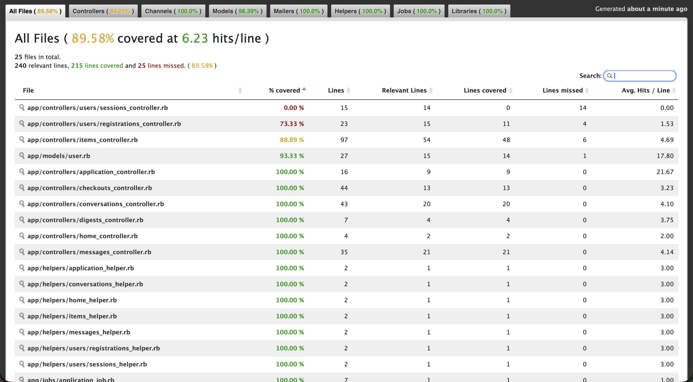

# CSCI3100-Group16-Secondhand-Marketplace

CUHK Secondhand Marketplace — a Rails 8 web app for buying and selling second-hand items within the CUHK community.

---

## Table of Contents

- [Setup Guide](#setup-guide)
  - [Prerequisites](#prerequisites)
  - [Installation](#installation)
  - [Configuration](#configuration)
  - [Running the App](#running-the-app)
- [How to Run Tests](#how-to-run-tests)
- [Implemented Features](#implemented-features)
- [SimpleCov Report](#simplecov-report)

---

## Setup Guide

### Prerequisites

- **Ruby** 3.3.8 (see `.ruby-version`)
- **PostgreSQL** (hosted on [Supabase](https://supabase.com))
- **Node.js** (for assets)
- **Bundler** (`gem install bundler`)

### Installation

```bash
git clone https://github.com/Iriscsl/CSCI3100-Group16-Secondhand-Marketplace.git
cd CSCI3100-Group16-Secondhand-Marketplace
bundle install
```

### Configuration

1. Copy the environment template:
   ```bash
   cp .env.example .env.development
   ```

2. Fill in the **Supabase database credentials** (from Supabase Dashboard → Project Settings → Database → Connection string, use the Session/Transaction mode pooler):
   - `DATABASE_HOST` — pooler host, e.g. `aws-0-ap-southeast-1.pooler.supabase.com`
   - `DATABASE_PORT` — `6543`
   - `DATABASE_NAME` — `postgres`
   - `DATABASE_USERNAME` — `postgres.YOUR_PROJECT_REF`
   - `DATABASE_PASSWORD` — your Supabase database password
   - `DATABASE_SSLMODE` — `require`
   - `DATABASE_PREPARED_STATEMENTS` — `false`

3. Set **Gmail SMTP credentials** (optional — if omitted, emails open in-browser via `letter_opener`):
   - `GMAIL_USERNAME` — your Gmail address
   - `GMAIL_APP_PASSWORD` — a Gmail App Password

4. Set **Stripe API keys** (optional — required for payment checkout):
   - `STRIPE_SECRET_KEY`
   - `STRIPE_PUBLISHABLE_KEY`

### Running the App

```bash
bin/dev
```

Then visit [http://localhost:3000](http://localhost:3000).

---

## How to Run Tests

### Minitest (unit & controller tests)

```bash
bin/rails test
```

### RSpec (model & request specs)

```bash
bundle exec rspec
```

### Cucumber (acceptance / BDD tests)

```bash
bundle exec cucumber
```

### All tests with coverage

SimpleCov is configured to generate a coverage report. After running the test suite, open `coverage/index.html` in your browser.

---

## Implemented Features

| Feature Name | Primary Developer | Secondary Developer | Notes |
|---|---|---|---|
| User Authentication, multi-tenant structure | @shanli030 |  | Sign up, login, logout with Devise; CUHK Link email validation (`@link.cuhk.edu.hk`) |
| Item CRUD, lifestyle UI | @Iriscsl |   | listings, Available/Reserved/Sold |
| Search, filters| @sheenachann|   | Fuzzy search: Autocomplete showing suggestions as user type |
| Real-time chat | @leungvanice |   | Web-socket based messaging between buyer and seller |
|Payments, background jobs, email| @dizzyryan |   | Daily digest on new items in user’s community |

---

## SimpleCov Report

<!-- Replace the path below with the actual screenshot once generated -->


> **To generate:** run all three test suites (`bundle exec rspec`, `bin/rails test`, and `bundle exec cucumber`) so that SimpleCov merges their coverage, then open `coverage/index.html` and save a screenshot as `docs/simplecov.png`.
